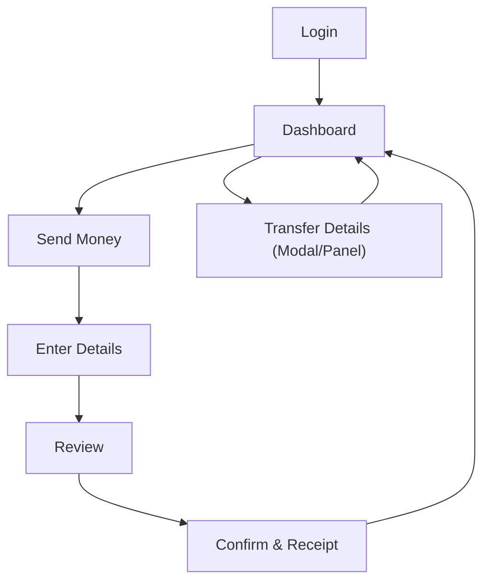

## 1. Product Overview
A desktop-first Laravel + Bootstrap dashboard for logged-in users to send money and track transfers.
It focuses on a clean admin-style layout and a simple, safe “Send Money” flow with encrypted transfer data.

## 2. Core Features

### 2.1 User Roles
| Role | Registration Method | Core Permissions |
|------|---------------------|------------------|
| Authenticated User | Email + password (standard login) | View dashboard, create transfers (Send Money), view transfer history and details |
| Admin (optional for MVP) | Seeded / manual creation | View all transfers, investigate issues (read-only in MVP) |

### 2.2 Feature Module
Our dashboard requirements consist of the following main pages:
1. **Login**: email/password login, basic validation, session creation.
2. **Dashboard**: dashboard layout (sidebar + topbar), account summary, recent transfers list, transfer detail preview.
3. **Send Money**: multi-step send flow (enter details → review → confirmation), save transfer record, show receipt.

### 2.3 Page Details
| Page Name | Module Name | Feature description |
|-----------|-------------|---------------------|
| Login | Authentication form | Authenticate with email and password; show inline validation errors; redirect to Dashboard on success |
| Login | Session handling | Create/destroy session; provide logout action that returns to Login |
| Dashboard | Shell layout | Render persistent sidebar navigation + topbar (user menu, logout); highlight active route |
| Dashboard | Account summary cards | Display available balance and basic account identifiers (masked); show last updated timestamp |
| Dashboard | Recent transfers table | List recent transfers with status, amount, recipient (masked), created date; support basic sorting by date (latest first) |
| Dashboard | Transfer details view | Open a details panel/modal for a selected transfer to show full receipt fields allowed for the user |
| Send Money | Step 1: Enter transfer details | Capture recipient name, recipient account/identifier, amount, currency, optional note; validate required fields and formatting |
| Send Money | Step 2: Review | Show a read-only summary of entered details (mask sensitive recipient fields); allow back/edit |
| Send Money | Step 3: Confirm + create transfer | Create a transfer record with an initial status; show a confirmation/receipt state; prevent double submission |
| Send Money | Encryption-aware handling | Ensure sensitive recipient fields are stored encrypted; avoid exposing plaintext in UI/logs; display masked values in the receipt |

## 3. Core Process
**Authenticated User Flow**
1. You open the Login page and sign in with email/password.
2. You land on the Dashboard to view balance and recent transfers.
3. You go to Send Money.
4. You enter recipient + amount + optional note, then review the details.
5. You confirm to create the transfer, then view a receipt/confirmation.
6. You return to Dashboard to see the new transfer in the recent list and open its details.

