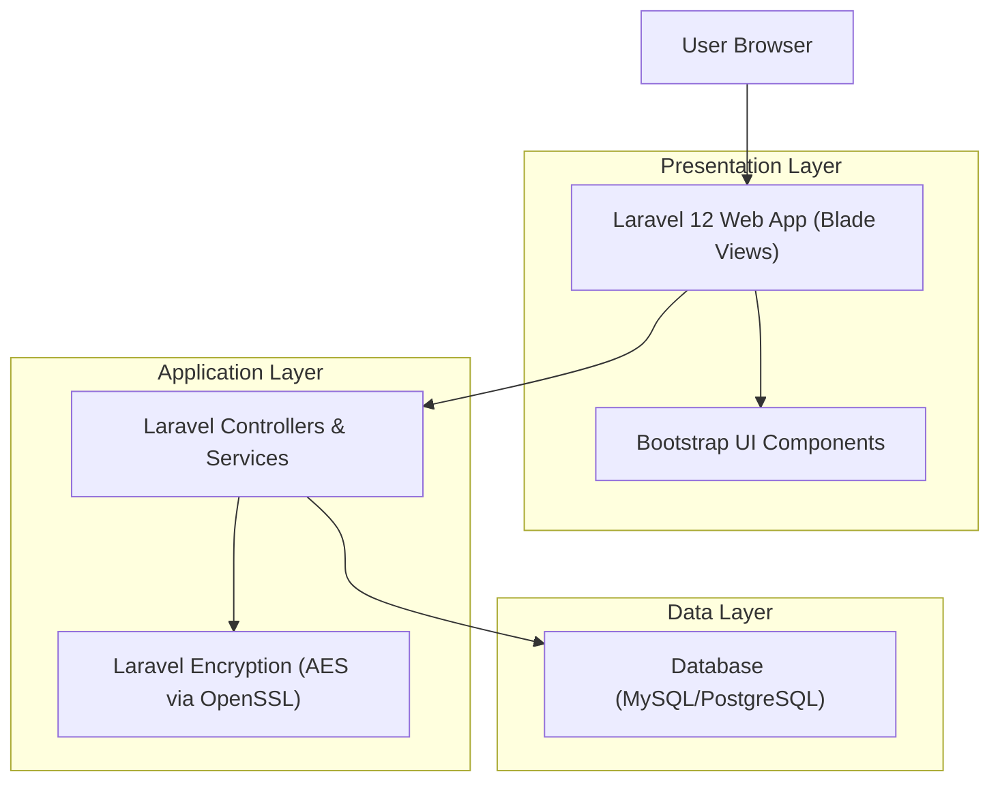
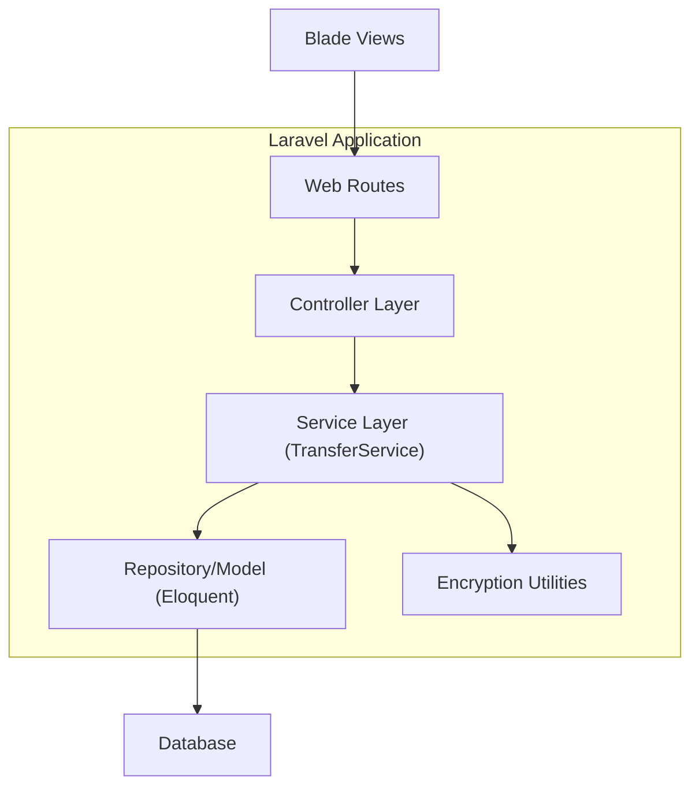
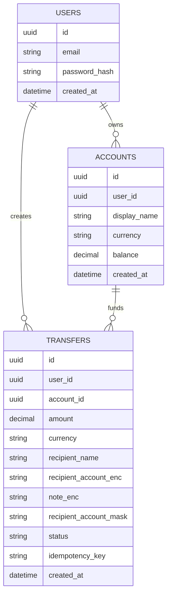

## 1.Architecture design


## 2.Technology Description
- Frontend: Blade templates + Bootstrap@5 (dashboard layout, forms, tables)
- Backend: Laravel@12 (session auth, routing, validation, encryption)
- Database: MySQL or PostgreSQL (users, accounts, transfers)

## 3.Route definitions
| Route | Purpose |
|-------|---------|
| /login | Render login form and authenticate user |
| /logout | End session and redirect to /login |
| /dashboard | Render main dashboard shell with summary + recent transfers |
| /send-money | Render multi-step Send Money UI (enter/review/confirm) |
| /transfers/{id} | View a single transfer receipt/details (used by modal/panel or standalone) |

## 4.API definitions (If it includes backend services)
This MVP can be fully server-rendered (no separate API required). If you later add AJAX for the recent transfers table or the transfer detail modal, keep endpoints minimal and session-authenticated.

Shared TypeScript-like shapes (conceptual) for UI rendering:
```ts
export type TransferStatus = "draft" | "pending" | "completed" | "failed";

export type Transfer = {
  id: string;
  userId: string;
  amount: number;
  currency: string;
  recipientName: string;
  recipientAccountMasked: string;
  status: TransferStatus;
  createdAt: string;
};
```

## 5.Server architecture diagram (If it includes backend services)


## 6.Data model(if applicable)

### 6.1 Data model definition


### 6.2 Data Definition Language
Users (users)
```sql
CREATE TABLE users (
  id CHAR(36) PRIMARY KEY,
  email VARCHAR(255) NOT NULL UNIQUE,
  password_hash VARCHAR(255) NOT NULL,
  created_at TIMESTAMP NULL,
  updated_at TIMESTAMP NULL
);
```

Accounts (accounts)
```sql
CREATE TABLE accounts (
  id CHAR(36) PRIMARY KEY,
  user_id CHAR(36) NOT NULL,
  display_name VARCHAR(100) NOT NULL,
  currency VARCHAR(10) NOT NULL,
  balance DECIMAL(18,2) NOT NULL DEFAULT 0,
  created_at TIMESTAMP NULL,
  updated_at TIMESTAMP NULL
);

CREATE INDEX idx_accounts_user_id ON accounts(user_id);
```

Transfers (transfers)
```sql
CREATE TABLE transfers (
  id CHAR(36) PRIMARY KEY,
  user_id CHAR(36) NOT NULL,
  account_id CHAR(36) NOT NULL,

  amount DECIMAL(18,2) NOT NULL,
  currency VARCHAR(10) NOT NULL,

  recipient_name VARCHAR(120) NOT NULL,
  recipient_account_mask VARCHAR(64) NOT NULL,

  recipient_account_enc TEXT NOT NULL,
  note_enc TEXT NULL,

  status VARCHAR(20) NOT NULL,
  idempotency_key VARCHAR(80) NOT NULL,

  created_at TIMESTAMP NULL,
  updated_at TIMESTAMP NULL
);

CREATE INDEX idx_transfers_user_id_created_at ON transfers(user_id, created_at);
CREATE UNIQUE INDEX uq_transfers_user_idempotency ON transfers(user_id, idempotency_key);
```

## AES-based encryption considerations (transfer data)
- Field-level encryption: store sensitive transfer fields (e.g., recipient account/identifier, optional note) encrypted at rest (AES) using Laravel’s encryption utilities or encrypted model casts.
- Masked duplicates: also store a masked recipient account (e.g., last 4 digits) in a separate non-encrypted column for display without decrypting.
- Queryability: avoid encrypting fields you must filter/sort on (e.g., amount, currency, status, created_at). If you need “search by account”, use a separate hashed index (e.g., SHA-256 of normalized identifier) rather than decrypting every row.
- Key management: protect and rotate the application encryption key (APP_KEY). If rotation is required, implement a re-encryption job and version encrypted payloads.
- Encryption boundaries: decrypt only in the service layer right before rendering an authorized view; never log plaintext and avoid putting decrypted values into exceptions.
- Transport + sessions: use TLS, secure cookies, and CSRF protection for all state-changing requests.
- Idempotency: require an idempotency key per send attempt to prevent duplicate transfers on refresh/retry (especially important when encrypting and persisting payloads).
